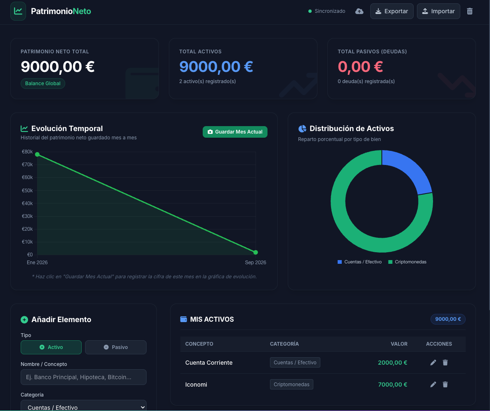

# Gestor de Patrimonio Neto

Dashboard web sencillo para registrar y consultar el patrimonio neto personal. Permite gestionar activos y deudas, consultar la evolución histórica y guardar copias de seguridad localmente o en un GitHub Gist.



## Funcionalidades

- Registro de activos y pasivos con nombre, categoría y valor.
- Cálculo automático del total de activos, deudas y patrimonio neto.
- Gráfico de evolución mensual del patrimonio.
- Gráfico de distribución de activos por categoría.
- Edición y eliminación de registros.
- Persistencia local mediante `localStorage`.
- Exportación e importación de copias de seguridad en formato JSON.
- Sincronización opcional con un GitHub Gist privado o público.
- Interfaz adaptable para escritorio y móvil.

## Tecnologías

- HTML, CSS y JavaScript vanilla.
- Tailwind CSS mediante CDN.
- Chart.js mediante CDN.
- GitHub Gists API para la sincronización opcional.

No hay servidor propio ni base de datos. La aplicación puede ejecutarse como una página estática.

## Uso local

Abre `index.html` en el navegador. La aplicación necesita conexión a Internet para cargar Tailwind CSS, Font Awesome, Chart.js y las fuentes externas.

Los datos se guardan automáticamente en el almacenamiento local del navegador. Por eso, al borrar los datos del navegador o cambiar de dispositivo, los datos locales no estarán disponibles. Usa **Exportar** para crear una copia de seguridad.

## Copias de seguridad

### Exportar

Pulsa **Exportar** para descargar un archivo con todos los activos, pasivos e historiales actuales. El archivo se genera como JSON y puede guardarse en un lugar seguro.

### Importar

Pulsa **Importar** y selecciona un archivo JSON exportado previamente. El contenido debe tener esta estructura mínima:

```json
{
  "items": [],
  "history": []
}
```

La importación reemplaza los datos que están cargados actualmente en la aplicación.

## Sincronización con GitHub Gist

La sincronización es opcional. Cuando está configurada, la aplicación lee y actualiza el archivo `patrimonio.json` dentro del Gist.

### Crear el Gist desde cero

1. Inicia sesión en [GitHub](https://github.com/).
2. Abre [Crear un nuevo Gist](https://gist.github.com/).
3. En el nombre del archivo escribe exactamente `patrimonio.json`.
4. Introduce un JSON inicial válido, por ejemplo:

   ```json
   {
     "items": [],
     "history": []
   }
   ```

5. Elige **Create secret gist** para que el Gist no aparezca públicamente en las búsquedas.
6. Pulsa **Create secret gist**.
7. Copia el identificador del Gist. Es la última parte de su URL:

   ```text
   https://gist.github.com/usuario/0123456789abcdef
   																		^^^^^^^^^^^^^^^^
   																		Gist ID
   ```

### Crear el token de GitHub

La aplicación necesita un token personal para leer y modificar el Gist.

1. En GitHub, abre **Settings**.
2. Ve a **Developer settings**.
3. Entra en **Personal access tokens**.
4. Puedes crear un token clásico con el permiso `gist`, o un token de permisos detallados con acceso de lectura y escritura para Gists.
5. Define una fecha de expiración razonable y genera el token.
6. Copia el token inmediatamente. GitHub no volverá a mostrarlo completo.

No compartas el token ni lo guardes en el repositorio.

### Configurar la aplicación

1. En el dashboard, pulsa el botón de configuración de sincronización con el icono de nube.
2. Introduce el **Gist ID**.
3. Introduce el **GitHub Token**.
4. Pulsa **Probar conexión**.
5. Si la prueba es correcta, pulsa **Guardar**.

Después de guardar, la aplicación descargará los datos del Gist. Los cambios posteriores se guardarán localmente y se enviarán al Gist cuando haya conexión.

### Seguridad y limitaciones

- El token se guarda sin cifrar en `localStorage` en el dispositivo actual.
- No uses esta aplicación en un ordenador compartido si vas a configurar un token personal.
- Revoca el token desde GitHub si el dispositivo se pierde o el token queda expuesto.
- Un Gist secreto no es un mecanismo de cifrado: cualquiera que tenga su URL y autorización suficiente podría acceder a él.
- La sincronización no sustituye a las copias de seguridad exportadas.

## Desconectar la sincronización

Abre la configuración de sincronización y pulsa **Desconectar**. Esto elimina las credenciales guardadas en el navegador, pero no borra el Gist ni los datos locales.

## Reiniciar los datos

El botón de papelera elimina los datos actuales del almacenamiento local y restaura los datos de ejemplo incluidos en la aplicación.

## TODO

[] ...
